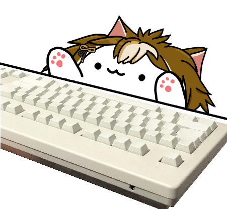

# mac-typing-cat-gorou-ver



This is a fork of the mac-typing-cat. This fork disables the transparent window to allow it to work under macOS 11+. You will need Python downloaded from python website instead of the macOS bundled TK. This fork also includes gorou skin instead of original bongo cat.

works for **macOS only**. For Windows / Linux, check out [bongocat-osu](https://github.com/kuroni/bongocat-osu).

## Prerequisites

```bash
python3 -m pip install pyobjc-framework-ApplicationServices pyobjc-framework-CoreText
```

## Usage

```bash
python3 main.py
```

If the program successfully launches but doesn't respond to global keypressed, retry with:

```bash
sudo python3 main.py
```

If the program quits with

```plain
ERROR: Unable to create event tap.
```

You need to allow `Terminal` to control your computer by going to `System Preferences.app > Security & Privacy > Privacy > Accessibility` and check on `Terminal`.

Note that it's not floating on top of all windows automatically. The transparent option is also broken. You need to capture it separately in your streaming software (e.g. Window capture in OBS) and adjust its size / position and enable color key.

## License

The original cat image is from [bongo.cat](https://bongo.cat/) by Eric Huber (@Externalizable). Original art courtesy of @StrayRogue. Meme by @DitzyFlama. Gorou is a character from Genshin Impact by Mihoyo. Modified art by @ZephRay.

Codes copied from other websites or projects (see comment in code) may have their own license.

Other parts are released into public domain.
